# JOBSHEET 12 : PEMROGRAMAN ASYNCHRONOUS

### NIM : 2141720180

### NAMA : Magfiroh Indah Karisma

## Praktikum 1: Mengunduh Data dari Web Service (API)
### Langkah 1: Buat Project Baru
Buatlah sebuah project flutter baru dengan nama books di folder src week-12 repository GitHub Anda.

Kemudian Tambahkan dependensi http dengan mengetik perintah berikut di terminal.

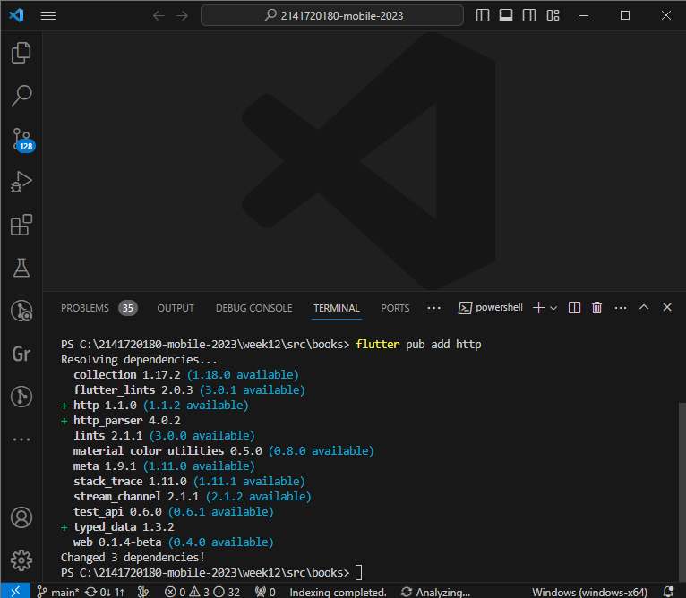
### Langkah 2: Cek file pubspec.yaml
Jika berhasil install plugin, pastikan plugin http telah ada di file pubspec ini seperti berikut.

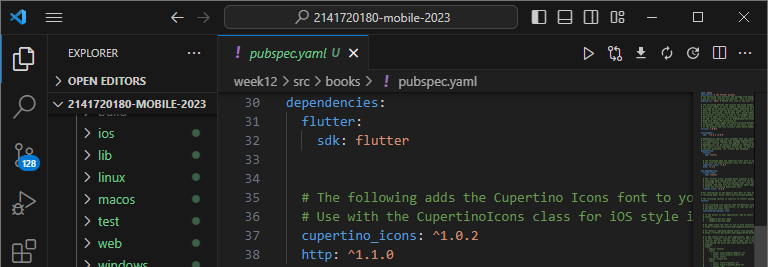

### Langkah 3: Buka file main.dart
Ketiklah kode seperti berikut ini.

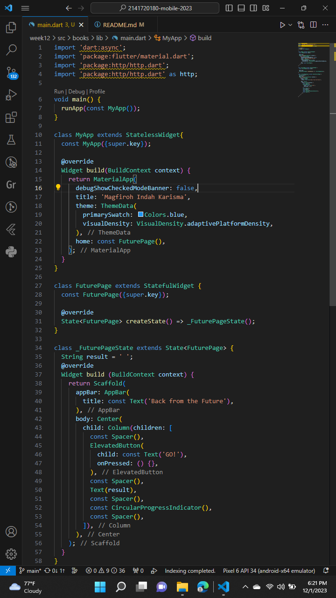

#### Soal 1: Tambahkan nama panggilan Anda pada title app sebagai identitas hasil pekerjaan Anda.
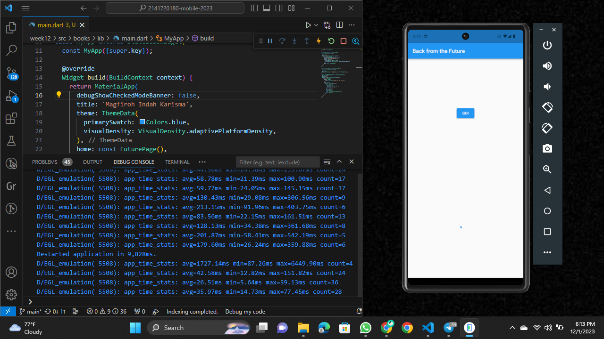

### Langkah 4: Tambah method getData()
Tambahkan method ini ke dalam class _FuturePageState yang berguna untuk mengambil data dari API Google Books.

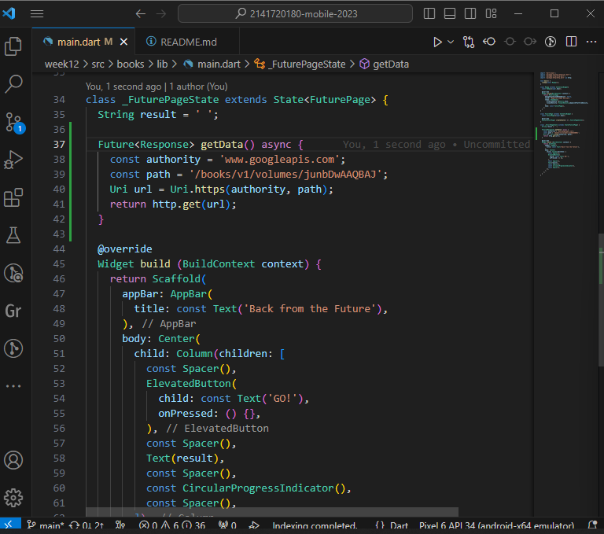

#### Soal 2
- Carilah judul buku favorit Anda di Google Books, lalu ganti ID buku pada variabel path di kode tersebut. Caranya ambil di URL browser Anda seperti gambar berikut ini.

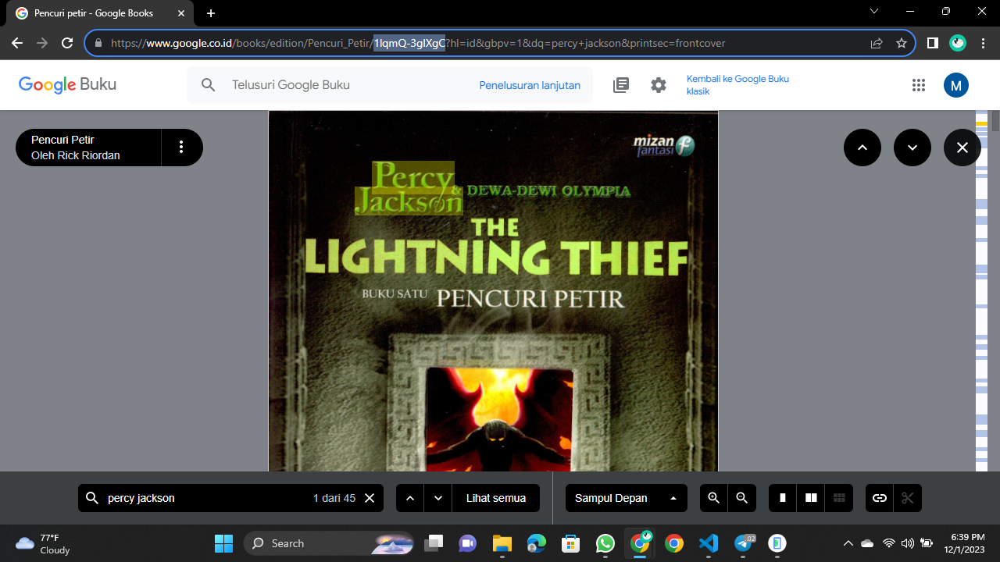

- Kemudian cobalah akses di browser URI tersebut dengan lengkap seperti ini. Jika menampilkan data JSON, maka Anda telah berhasil. Lakukan capture milik Anda dan tulis di README pada laporan praktikum. Lalu lakukan commit dengan pesan "W12: Soal 2".

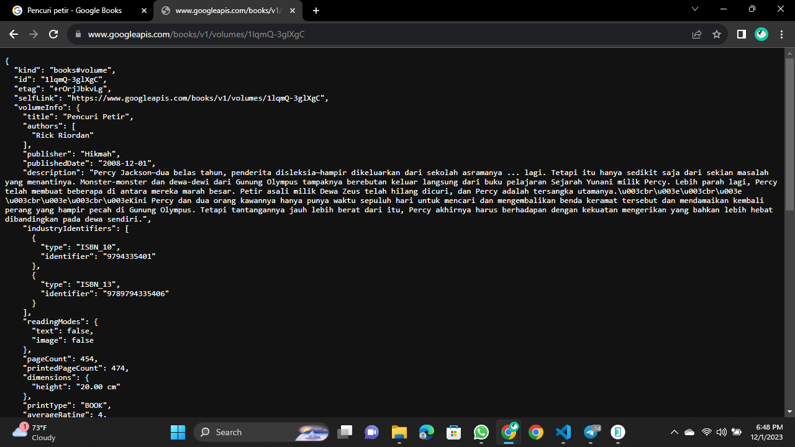

### Langkah 5: Tambah kode di ElevatedButton
Tambahkan kode pada onPressed di ElevatedButton seperti berikut.

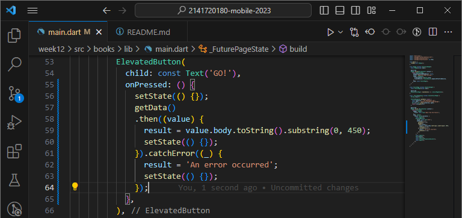

#### Soal 3
- Jelaskan maksud kode langkah 5 tersebut terkait substring dan catchError!
#### Tentu! `substring` adalah metode yang digunakan dalam kode tersebut untuk mengambil sebagian teks dari sebuah string. Dalam kasus ini, `value.body.toString()` mengembalikan teks dari respons yang diperoleh dari fungsi `getData()`, dan `substring(0, 450)` mengambil karakter dari indeks 0 hingga indeks 449 dari teks tersebut, sehingga menghasilkan potongan teks sepanjang 450 karakter pertama.

#### Sementara itu, `catchError` adalah bagian dari konsep error handling dalam Dart/Flutter. Dalam blok `.then()` dari pemanggilan `getData()`, `catchError` ditetapkan untuk menangani kesalahan yang mungkin terjadi saat menjalankan fungsi `getData()`. Jika ada kesalahan dalam pengambilan data, blok `catchError` akan menangkapnya dan menjalankan fungsi yang diberikan, dalam hal ini mengubah nilai variabel 'result' menjadi 'An error occurred'. Ini memungkinkan aplikasi untuk mengelola situasi yang tidak terduga atau kesalahan yang mungkin terjadi saat mengambil data.
- Capture hasil praktikum Anda berupa GIF dan lampirkan di README. Lalu lakukan commit dengan pesan "W12: Soal 3".

## Praktikum 2: Menggunakan await/async untuk menghindari callbacks
### Langkah 1: Buka file main.dart
Tambahkan tiga method berisi kode seperti berikut di dalam class _FuturePageState.

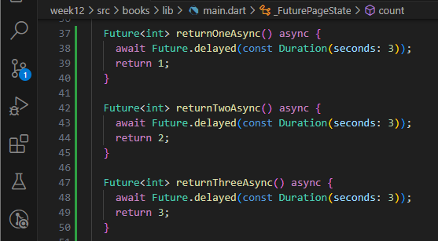

### Langkah 2: Tambah method count()
Lalu tambahkan lagi method ini di bawah ketiga method sebelumnya.

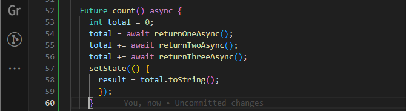

### Langkah 3: Panggil count()
Lakukan comment kode sebelumnya, ubah isi kode onPressed() menjadi seperti berikut.

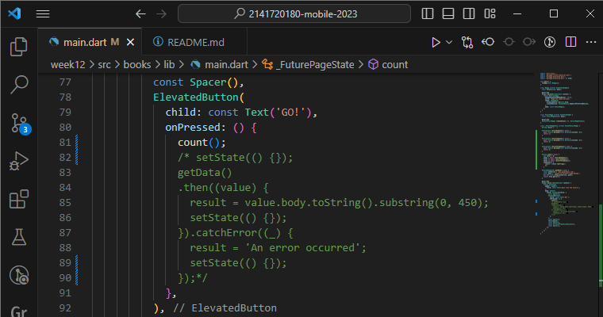

### Langkah 4: Run
Akhirnya, run atau tekan F5 jika aplikasi belum running. Maka Anda akan melihat seperti gambar berikut, hasil angka 6 akan tampil setelah delay 9 detik.

#### Soal 4
- Jelaskan maksud kode langkah 1 dan 2 tersebut!
#### KOde tersebut adalah bagian dari pembuatan method-method asinkron di dalam kelas `_FuturePageState` dalam sebuah aplikasi Flutter. Method-method `returnOneAsync`, `returnTwoAsync`, dan `returnThreeAsync` merupakan fungsi-fungsi yang menggunakan `await` untuk menunda eksekusi selama 3 detik masing-masing sebelum mengembalikan nilai berturut-turut 1, 2, dan 3. Selanjutnya, terdapat method `count()` yang digunakan untuk menjalankan fungsi-fungsi asinkron sebelumnya secara berurutan dan menjumlahkan hasilnya ke dalam variabel `total`. Method `count()` menggunakan `await` untuk menunggu hasil dari setiap fungsi asinkron sebelum melanjutkan ke fungsi berikutnya. Setelah semua nilai dikumpulkan, nilai total diubah menjadi string dan disimpan dalam variabel `result`. Akhirnya, `setState()` digunakan untuk memperbarui tampilan UI dengan nilai yang sudah dihitung.

- Capture hasil praktikum Anda berupa GIF dan lampirkan di README. Lalu lakukan commit dengan pesan "W12: Soal 4".

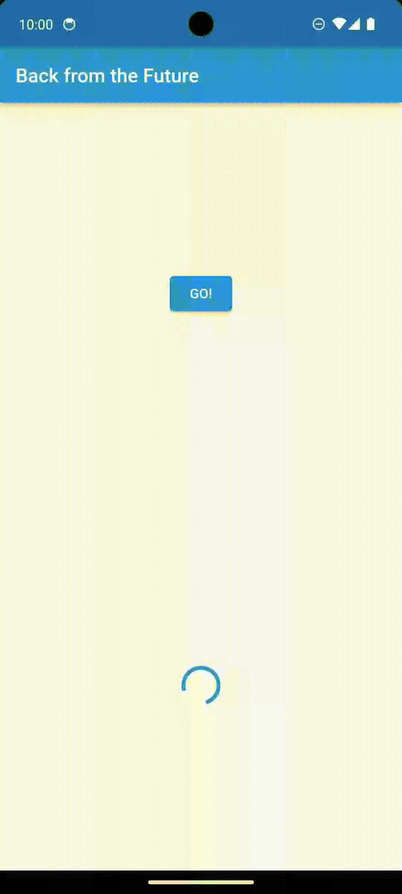

## Praktikum 3: Menggunakan Completer di Future
### Langkah 1: Buka main.dart
Pastikan telah impor package async berikut.

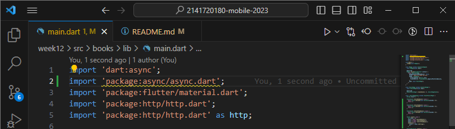

### Langkah 2: Tambahkan variabel dan method
Tambahkan variabel late dan method di class _FuturePageState seperti ini.

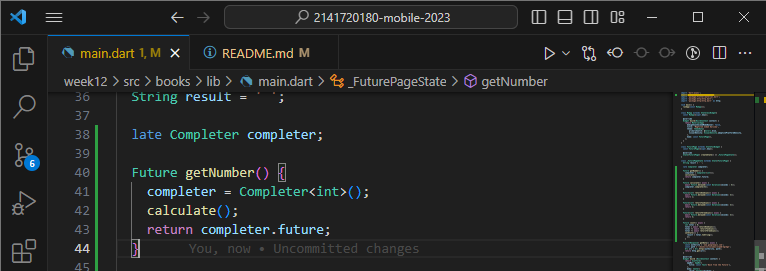

### Langkah 3: Ganti isi kode onPressed()
Tambahkan kode berikut pada fungsi onPressed(). Kode sebelumnya bisa Anda comment.

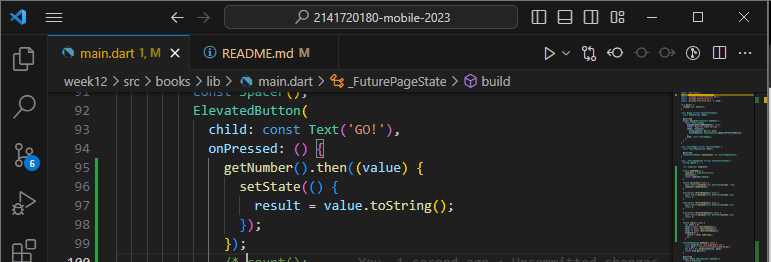

### Langkah 4:
Terakhir, run atau tekan F5 untuk melihat hasilnya jika memang belum running. Bisa juga lakukan hot restart jika aplikasi sudah running. Maka hasilnya akan seperti gambar berikut ini. Setelah 5 detik, maka angka 42 akan tampil.

#### Soal 5
- Jelaskan maksud kode langkah 2 tersebut!
#### Kode tersebut menambahkan variabel `completer` yang digunakan untuk mengelola proses asinkron dengan menggunakan `Completer`. Method `getNumber()` bertujuan untuk menginisialisasi `completer` sebagai `Completer<int>`, kemudian memanggil method `calculate()` untuk melakukan penundaan selama 5 detik sebelum mengembalikan nilai 42 melalui `completer.complete(42)`. Hasil perhitungan ini dapat diakses melalui future yang dikembalikan oleh `getNumber()`, sehingga memungkinkan aplikasi untuk menunggu dan mendapatkan nilai tersebut untuk digunakan di bagian lain dari kode.

- Capture hasil praktikum Anda berupa GIF dan lampirkan di README. Lalu lakukan commit dengan pesan "W12: Soal 5".

### Langkah 5: Ganti method calculate()
Gantilah isi code method calculate() seperti kode berikut, atau Anda dapat membuat calculate2()

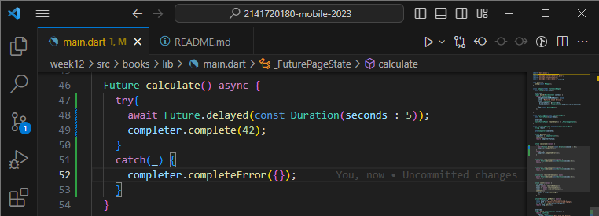

### Langkah 6: Pindah ke onPressed()
Ganti menjadi kode seperti berikut.

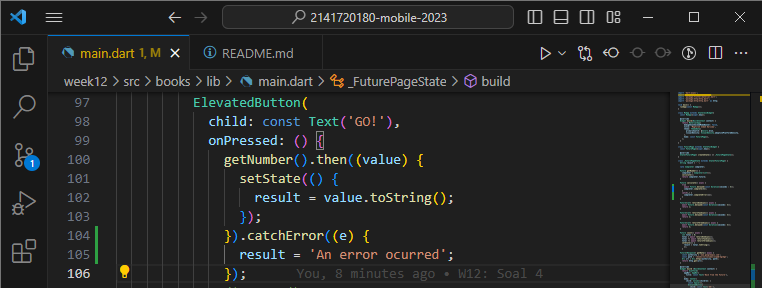

#### Soal 6
- Jelaskan maksud perbedaan kode langkah 2 dengan langkah 5-6 tersebut!
#### Dalam langkah kelima, perubahan dilakukan pada method `calculate()` di mana perubahan dilakukan pada bagian penanganan kesalahan. Sekarang, method ini menggunakan blok `try-catch` untuk mengelola proses asinkron. Saat proses yang tertunda dalam `Future.delayed` selesai, nilai 42 akan dikembalikan melalui `completer.complete(42)`. Namun, jika terjadi kesalahan (error) selama penundaan, blok `catch` akan dieksekusi dan `completer.completeError({})` digunakan untuk menandai bahwa terjadi kesalahan dengan mengembalikan objek kosong.

#### Langkah keenam mengubah bagian `onPressed()` di mana pemanggilan `getNumber().then((value) {...})` dipindahkan ke dalam `onPressed()` dari tombol. Kemudian, penanganan kesalahan (error handling) ditambahkan dengan pemanggilan `.catchError((e) {...})`. Ketika future dari `getNumber()` menyelesaikan tugasnya, nilai yang diterima akan diubah menjadi string dan diperbarui ke dalam variabel `result`. Namun, jika ada kesalahan yang terjadi dalam proses tersebut, pesan 'An error occurred' akan disimpan dalam variabel `result`.

- Capture hasil praktikum Anda berupa GIF dan lampirkan di README. Lalu lakukan commit dengan pesan "W12: Soal 6".

## Praktikum 4: Memanggil Future secara paralel

### Langkah 1: Buka file main.dart
Tambahkan method ini ke dalam class _FuturePageState

### Langkah 2: Edit onPressed()
Anda bisa hapus atau comment kode sebelumnya, kemudian panggil method dari langkah 1 tersebut.

### Langkah 3: Run
Anda akan melihat hasilnya dalam 3 detik berupa angka 6 lebih cepat dibandingkan praktikum sebelumnya menunggu sampai 9 detik.

#### Soal 7: Capture hasil praktikum Anda berupa GIF dan lampirkan di README. Lalu lakukan commit dengan pesan "W12: Soal 7".

### Langkah 4: Ganti variabel futureGroup
Anda dapat menggunakan FutureGroup dengan Future.wait seperti kode berikut.

#### Soal 8: Jelaskan maksud perbedaan kode langkah 1 dan 4!

## Praktikum 5: Menangani Respon Error pada Async Code

### Langkah 1: Buka file main.dart
Tambahkan method ini ke dalam class _FuturePageState

### Langkah 2: ElevatedButton
Ganti dengan kode berikut

### Langkah 3: Run
Lakukan run dan klik tombol GO! maka akan menghasilkan seperti gambar berikut.

#### Soal 9: Capture hasil praktikum Anda berupa GIF dan lampirkan di README. Lalu lakukan commit dengan pesan "W12: Soal 9".

### Langkah 4: Tambah method handleError()
Tambahkan kode ini di dalam class _FutureStatePage

#### Soal 10: Panggil method handleError() tersebut di ElevatedButton, lalu run. Apa hasilnya? Jelaskan perbedaan kode langkah 1 dan 4!

## Praktikum 6: Menggunakan Future dengan StatefulWidget

### Langkah 1: install plugin geolocator
Tambahkan plugin geolocator dengan mengetik perintah berikut di terminal.

### Langkah 2: Tambah permission GPS
Jika Anda menargetkan untuk platform Android, maka tambahkan baris kode berikut di file 
android/app/src/main/androidmanifest.xml

Jika Anda menargetkan untuk platform iOS, maka tambahkan kode ini ke file Info.plist

### Langkah 3: Buat file geolocation.dart
Tambahkan file baru ini di folder lib project Anda.

### Langkah 4: Buat StatefulWidget
Buat class LocationScreen di dalam file geolocation.dart

### Langkah 5: Isi kode geolocation.dart

#### Soal 11: Tambahkan nama panggilan Anda pada tiap properti title sebagai identitas pekerjaan Anda.

### Langkah 6: Edit main.dart
Panggil screen baru tersebut di file main Anda seperti berikut.

### Langkah 7: Run
Run project Anda di device atau emulator (bukan browser), maka akan tampil seperti berikut ini.

### Langkah 8: Tambahkan animasi loading
Tambahkan widget loading seperti kode berikut. Lalu hot restart, perhatikan perubahannya.

#### Soal 12
- Jika Anda tidak melihat animasi loading tampil, kemungkinan itu berjalan sangat cepat. Tambahkan delay pada method getPosition() dengan kode await Future.delayed(const Duration(seconds: 3));
- Apakah Anda mendapatkan koordinat GPS ketika run di browser? Mengapa demikian?
- Capture hasil praktikum Anda berupa GIF dan lampirkan di README. Lalu lakukan commit dengan pesan "W12: Soal 12".

## Praktikum 7: Manajemen Future dengan FutureBuilder

### Langkah 1: Modifikasi method getPosition()
Buka file geolocation.dart kemudian ganti isi method dengan kode ini.

### Langkah 2: Tambah variabel
Tambah variabel ini di class _LocationScreenState

### Langkah 3: Tambah initState()
Tambah method ini dan set variabel position

### Langkah 4: Edit method build()
Ketik kode berikut dan sesuaikan. Kode lama bisa Anda comment atau hapus.

#### Soal 13
- Apakah ada perbedaan UI dengan praktikum sebelumnya? Mengapa demikian?
- Capture hasil praktikum Anda berupa GIF dan lampirkan di README. Lalu lakukan commit dengan pesan "W12: Soal 13".
- Seperti yang Anda lihat, menggunakan FutureBuilder lebih efisien, clean, dan reactive dengan Future bersama UI.

### Langkah 5: Tambah handling error
Tambahkan kode berikut untuk menangani ketika terjadi error. Kemudian hot restart.

#### Soal 14
- Apakah ada perbedaan UI dengan langkah sebelumnya? Mengapa demikian?
- Capture hasil praktikum Anda berupa GIF dan lampirkan di README. Lalu lakukan commit dengan pesan "W12: Soal 14".

## Praktikum 8: Navigation route dengan Future Function

### Langkah 1: Buat file baru navigation_first.dart
Buatlah file baru ini di project lib Anda.

### Langkah 2: Isi kode navigation_first.dart

#### Soal 15
- Tambahkan nama panggilan Anda pada tiap properti title sebagai identitas pekerjaan Anda.
- Silakan ganti dengan warna tema favorit Anda.

### Langkah 3: Tambah method di class _NavigationFirstState
Tambahkan method ini.

### Langkah 4: Buat file baru navigation_second.dart
Buat file baru ini di project lib Anda. Silakan jika ingin mengelompokkan view menjadi satu folder dan sesuaikan impor yang dibutuhkan.

### Langkah 5: Buat class NavigationSecond dengan StatefulWidget

### Langkah 6: Edit main.dart
Lakukan edit properti home.

### Langkah 8: Run
Lakukan run, jika terjadi error silakan diperbaiki.

#### Soal 16
- Cobalah klik setiap button, apa yang terjadi ? Mengapa demikian ?
- Gantilah 3 warna pada langkah 5 dengan warna favorit Anda!
- Capture hasil praktikum Anda berupa GIF dan lampirkan di README. Lalu lakukan commit dengan pesan "W12: Soal 16".

## Praktikum 9: Memanfaatkan async/await dengan Widget Dialog

### Langkah 1: Buat file baru navigation_dialog.dart
Buat file dart baru di folder lib project Anda.

### Langkah 2: Isi kode navigation_dialog.dart

### Langkah 3: Tambah method async

### Langkah 4: Panggil method di ElevatedButton

### Langkah 5: Edit main.dart
Ubah properti home

### Langkah 6: Run
Coba ganti warna background dengan widget dialog tersebut. Jika terjadi error, silakan diperbaiki. Jika berhasil, akan tampil seperti gambar berikut.

#### Soal 17
- Cobalah klik setiap button, apa yang terjadi ? Mengapa demikian ?
- Gantilah 3 warna pada langkah 3 dengan warna favorit Anda!
- Capture hasil praktikum Anda berupa GIF dan lampirkan di README. Lalu lakukan commit dengan pesan "W12: Soal 17".