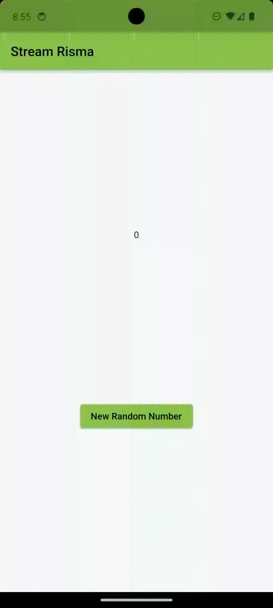
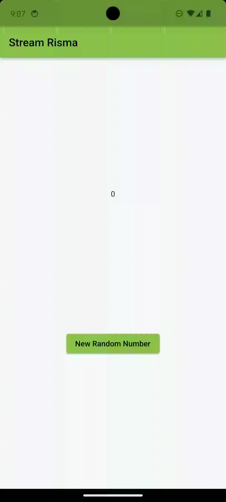
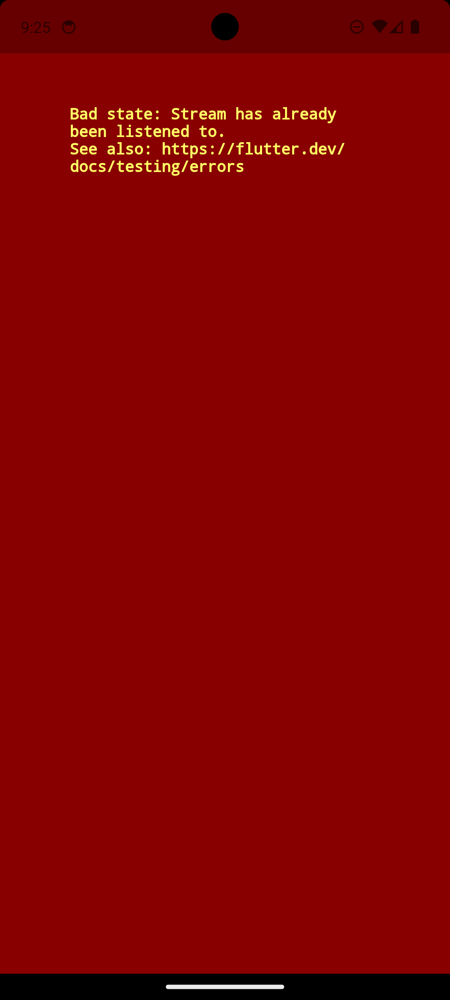
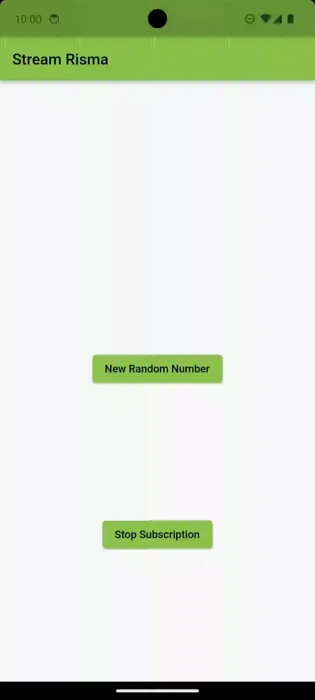
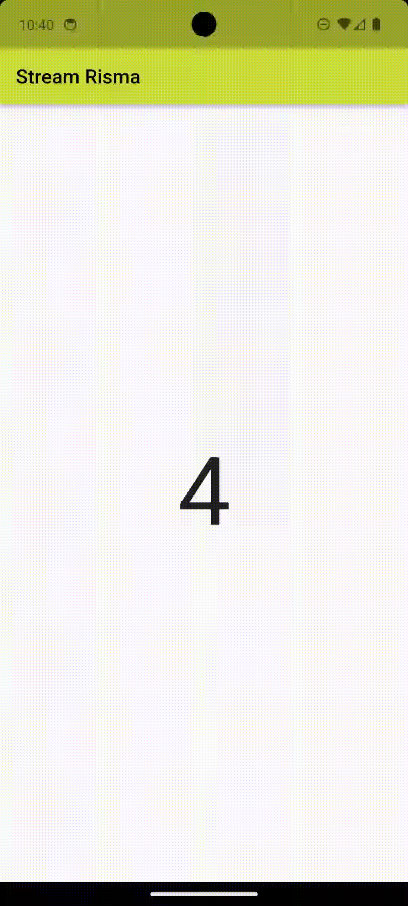

# JOBSHEET 13: STATE STREAMS BLOC

### NIM : 2141720180

### NAMA : Magfiroh Indah Karisma

## Praktikum 1: Dart Streams
### Soal 1
- Tambahkan nama panggilan Anda pada title app sebagai identitas hasil pekerjaan Anda.
- Gantilah warna tema aplikasi sesuai kesukaan Anda.

- Lakukan commit hasil jawaban Soal 1 dengan pesan "W13: Jawaban Soal 1"

### Soal 2
-Tambahkan 5 warna lainnya sesuai keinginan Anda pada variabel colors tersebut.

- Lakukan commit hasil jawaban Soal 2 dengan pesan "W13: Jawaban Soal 2"

### Soal 3
- Jelaskan fungsi keyword yield* pada kode tersebut!
#### `yield*` digunakan untuk mengirim nilai-nilai dari sebuah stream periodik yang dihasilkan oleh `Stream.periodic`. Fungsi ini akan menghasilkan *stream* yang akan mengirim nilai berulang dari daftar warna (`colors`) setiap detiknya. `yield*` digunakan di sini untuk mengirim nilai-nilai dari *stream* periodik tersebut. Setiap nilai yang dihasilkan oleh *stream* akan diteruskan ke *stream* yang dibuat oleh fungsi `getColors()` sebagai bagian dari aliran data yang diteruskan ke konsumen *stream* tersebut.
- Apa maksud isi perintah kode tersebut?
#### Kode tersebut membuat fungsi `getColors()` yang menghasilkan *stream* berkelanjutan dengan interval waktu satu detik. *Stream* ini mengirimkan nilai-nilai berulang dari daftar warna yang telah ditentukan, mengubah warna setiap detiknya sesuai dengan waktu yang berlalu.
- Lakukan commit hasil jawaban Soal 3 dengan pesan "W13: Jawaban Soal 3"

### Soal 4
- Capture hasil praktikum Anda berupa GIF dan lampirkan di README.

- Lakukan commit hasil jawaban Soal 4 dengan pesan "W13: Jawaban Soal 4"

### Soal 5
- Jelaskan perbedaan menggunakan listen dan await for (langkah 9) !
#### `listen()`: Metode `listen()` digunakan untuk mendengarkan nilai-nilai dari *stream* secara asinkron. Ini memungkinkan kita untuk memasang *listener* pada *stream* yang akan dipanggil setiap kali ada data baru yang dikirim. Dalam contoh Anda, `listen()` digunakan untuk mendengarkan perubahan warna dari `colorStream.getColors()` dan mengubah `bgColor` sesuai dengan setiap perubahan warna yang terjadi.
  
#### `await for`: Konstruksi `await for` digunakan dalam *async generator function* dan menunggu setiap nilai yang dikirim dari *stream* secara berurutan. Ini menunggu nilai dari *stream* dan mengeluarkan nilai-nilai tersebut satu per satu secara berurutan. Dalam kasus *stream* yang tidak berakhir, seperti `Stream.periodic` atau *stream* yang tak terhingga, penggunaan `await for` akan terus menunggu dan mengambil nilai-nilai yang diberikan oleh *stream* sampai *stream* tersebut diakhiri atau tidak ada nilai lain yang dikirim.

- Lakukan commit hasil jawaban Soal 5 dengan pesan "W13: Jawaban Soal 5"

## Praktikum 2: Stream controllers dan sinks
### Soal 6 
- Jelaskan maksud kode langkah 8 dan 10 tersebut!
#### Langkah 8: `initState()` digunakan untuk menginisialisasi properti dalam sebuah widget stateful saat widget tersebut pertama kali dibuat. Di sini, `initState()` membuat sebuah instance dari `NumberStream`, kemudian mengakses controller dari objek tersebut untuk mendapatkan akses ke *stream* data. *Stream* ini kemudian di-*listen* menggunakan metode `listen()` untuk mendengarkan perubahan-perubahan yang terjadi pada *stream* tersebut. Setiap kali ada data baru yang masuk ke *stream*, fungsi yang diberikan ke `listen()` akan dipanggil. Di dalam fungsi tersebut, `setState()` digunakan untuk memperbarui nilai `lastNumber` sesuai dengan data terakhir yang diterima dari *stream*.
#### Langkah 10: Fungsi `addRandomNumber()` menggunakan objek dari kelas `Random` untuk menghasilkan nomor acak antara 0 dan 9, lalu menambahkan nomor tersebut ke dalam *stream sink* `numberStream` dengan menggunakan metode `addNumberToSink()`.
- Capture hasil praktikum Anda berupa GIF dan lampirkan di README.

- Lalu lakukan commit dengan pesan "W13: Jawaban Soal 6".

### Soal 7
- Jelaskan maksud kode langkah 13 sampai 15 tersebut!
#### `addError()` menambahkan sebuah pesan error ke dalam *stream sink* menggunakan `controller.sink.addError('error')`. 

#### `.onError((error) { ... })` mendengarkan error yang mungkin terjadi pada *stream* dan menentukan tindakan yang diambil ketika error terjadi. Ketika error terdeteksi, fungsi yang diberikan ke `.onError()` akan dieksekusi. Dalam contoh ini, fungsi tersebut memperbarui nilai `lastNumber` menjadi -1 dalam `setState()`. 

#### `numberStream.addError();` memicu fungsi `addError()` yang telah didefinisikan sebelumnya untuk menambahkan pesan error ke dalam *stream*.
- Kembalikan kode seperti semula pada Langkah 15, comment addError() agar Anda dapat melanjutkan ke praktikum 3 berikutnya.
- Lalu lakukan commit dengan pesan "W13: Jawaban Soal 7".

## Praktikum 3: Injeksi data ke streams
### Soal 8 
- Jelaskan maksud kode langkah 1-3 tersebut!
#### Kode `StreamTransformer` untuk mengubah data dalam sebuah stream sebelum data tersebut diteruskan ke listener yang mendengarkan stream tersebut. `StreamTransformer` ini menerapkan transformasi yang ditentukan ke setiap nilai dalam stream sebelum hasil transformasi tersebut diteruskan ke listener. Saat terjadi error pada stream, penanganan error juga diatur di dalam `StreamTransformer` untuk mengubah nilai menjadi -1 sebelum diteruskan ke listener.
- Capture hasil praktikum Anda berupa GIF dan lampirkan di README.

- Lalu lakukan commit dengan pesan "W13: Jawaban Soal 8".

## Praktikum 4: Subscribe ke stream events
### Soal 9
- Jelaskan maksud kode langkah 2, 6 dan 8 tersebut!
#### Langkah kedua menambahkan kode yang menciptakan objek `NumberStream` dan `NumberStreamController`. `NumberStream` menghasilkan stream integer secara acak, sedangkan `NumberStreamController` mengontrol stream tersebut.

#### Langkah keenam menambahkan kode di `dispose()` untuk membatalkan subscription stream. Hal ini dilakukan agar terhindar dari memory leak yang bisa terjadi.

#### Langkah kedelapan menambahkan kode yang memeriksa apakah stream telah ditutup sebelum menambahkan data baru ke dalamnya. Jika stream sudah ditutup, nilai dari variabel `lastNumber` akan diubah menjadi -1.
- Capture hasil praktikum Anda berupa GIF dan lampirkan di README.

- Lalu lakukan commit dengan pesan "W13: Jawaban Soal 9".

## Praktikum 5: Multiple stream subscriptions
### Soal 10
- Jelaskan mengapa error itu bisa terjadi ?
#### Kesalahan terjadi ketika mencoba menambahkan dua langganan (subscription) pada satu stream tanpa membatalkan langganan sebelumnya. Situasi ini terjadi saat menginisialisasi dua langganan dalam metode `initState()`, di mana sudah ada langganan yang diinisialisasi untuk menangani stream yang sama secara bersamaan.

### Soal 11
- Jelaskan mengapa hal itu bisa terjadi ?
#### Saat mengklik tombol "New Random Number", akan terjadi pengulangan angka acak yang identik. Angka-angka ini terhubung dengan sebuah stream yang dikenali oleh dua objek subscription, yakni subscription dan subscription2. Stream ini akan menghasilkan peristiwa (angka acak) yang dipisahkan oleh tanda "-". Ketika tombol "Stop Stream" ditekan, langganan terhadap stream akan dihentikan, sehingga stream tidak lagi menghasilkan output, meskipun tombol "New Random Number" masih ditekan.
- Capture hasil praktikum Anda berupa GIF dan lampirkan di README.

- Lalu lakukan commit dengan pesan "W13: Jawaban Soal 10,11".

## Praktikum 6: StreamBuilder
### Soal 12
- Jelaskan maksud kode pada langkah 3 dan 7 !
#### Langkah 3: Dalam metode `getNumber`, digunakan `Stream.periodic` untuk membuat stream dari bilangan bulat dengan interval 1 detik. Angka acak antara 0 dan 9 dihasilkan dengan menggunakan `Random`, kemudian dikirim ke dalam stream melalui `yield* async*`, yang menciptakan stream dari nilai-nilai yang dihasilkan.

#### Langkah 7: Dalam membangun widget, `StreamBuilder` menggunakan data dari `numberStream` yang berasal dari `getNumber()` dalam `NumberStream`. Jika terdapat `snapshot.hasData`, widget menampilkan teks yang memuat nilai data. Saat terjadi kesalahan, hanya mencetak pesan "Error!" tanpa menampilkan konten apa pun. Ketika tidak ada data, widget yang tidak terlihat akan dikembalikan. Ini memungkinkan tampilan untuk beradaptasi dengan perubahan data yang diterima dari stream, sehingga menghasilkan tampilan yang cocok dengan kondisi stream saat itu.
- Capture hasil praktikum Anda berupa GIF dan lampirkan di README.

- Lalu lakukan commit dengan pesan "W13: Jawaban Soal 12".

## Praktikum 7: BLoC Pattern
### Soal 13
- Jelaskan maksud praktikum ini ! Dimanakah letak konsep pola BLoC-nya ?
- Capture hasil praktikum Anda berupa GIF dan lampirkan di README.
- Lalu lakukan commit dengan pesan "W13: Jawaban Soal 13".