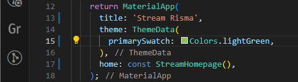
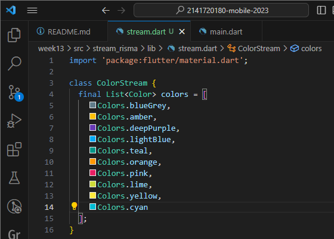

# JOBSHEET 13: STATE STREAMS BLOC

### NIM : 2141720180

### NAMA : Magfiroh Indah Karisma

## Praktikum 1: Dart Streams
### Soal 1
- Tambahkan nama panggilan Anda pada title app sebagai identitas hasil pekerjaan Anda.
- Gantilah warna tema aplikasi sesuai kesukaan Anda.

- Lakukan commit hasil jawaban Soal 1 dengan pesan "W13: Jawaban Soal 1"

### Soal 2
-Tambahkan 5 warna lainnya sesuai keinginan Anda pada variabel colors tersebut.

- Lakukan commit hasil jawaban Soal 2 dengan pesan "W13: Jawaban Soal 2"

### Soal 3
- Jelaskan fungsi keyword yield* pada kode tersebut!
#### `yield*` digunakan untuk mengirim nilai-nilai dari sebuah stream periodik yang dihasilkan oleh `Stream.periodic`. Fungsi ini akan menghasilkan *stream* yang akan mengirim nilai berulang dari daftar warna (`colors`) setiap detiknya. `yield*` digunakan di sini untuk mengirim nilai-nilai dari *stream* periodik tersebut. Setiap nilai yang dihasilkan oleh *stream* akan diteruskan ke *stream* yang dibuat oleh fungsi `getColors()` sebagai bagian dari aliran data yang diteruskan ke konsumen *stream* tersebut.
- Apa maksud isi perintah kode tersebut?
#### Kode tersebut membuat fungsi `getColors()` yang menghasilkan *stream* berkelanjutan dengan interval waktu satu detik. *Stream* ini mengirimkan nilai-nilai berulang dari daftar warna yang telah ditentukan, mengubah warna setiap detiknya sesuai dengan waktu yang berlalu.
- Lakukan commit hasil jawaban Soal 3 dengan pesan "W13: Jawaban Soal 3"

### Soal 4
- Capture hasil praktikum Anda berupa GIF dan lampirkan di README.
- Lakukan commit hasil jawaban Soal 4 dengan pesan "W13: Jawaban Soal 4"

### Soal 5
- Jelaskan perbedaan menggunakan listen dan await for (langkah 9) !
- Lakukan commit hasil jawaban Soal 5 dengan pesan "W13: Jawaban Soal 5"

## Praktikum 2: Stream controllers dan sinks
### Soal 6 
- Jelaskan maksud kode langkah 8 dan 10 tersebut!
- Capture hasil praktikum Anda berupa GIF dan lampirkan di README.
- Lalu lakukan commit dengan pesan "W13: Jawaban Soal 6".

### Soal 7
- Jelaskan maksud kode langkah 13 sampai 15 tersebut!
- Kembalikan kode seperti semula pada Langkah 15, comment addError() agar Anda dapat melanjutkan ke praktikum 3 berikutnya.
- Lalu lakukan commit dengan pesan "W13: Jawaban Soal 7".

## Praktikum 3: Injeksi data ke streams
### Soal 8 
- Jelaskan maksud kode langkah 1-3 tersebut!
- Capture hasil praktikum Anda berupa GIF dan lampirkan di README.
- Lalu lakukan commit dengan pesan "W13: Jawaban Soal 8".

## Praktikum 4: Subscribe ke stream events
### Soal 9
- Jelaskan maksud kode langkah 2, 6 dan 8 tersebut!
- Capture hasil praktikum Anda berupa GIF dan lampirkan di README.
- Lalu lakukan commit dengan pesan "W13: Jawaban Soal 9".

## Praktikum 5: Multiple stream subscriptions
### Soal 10
- Jelaskan mengapa error itu bisa terjadi ?

### Soal 11
- Jelaskan mengapa hal itu bisa terjadi ?
- Capture hasil praktikum Anda berupa GIF dan lampirkan di README.
- Lalu lakukan commit dengan pesan "W13: Jawaban Soal 10,11".

## Praktikum 6: StreamBuilder
### Soal 12
- Jelaskan maksud kode pada langkah 3 dan 7 !
- Capture hasil praktikum Anda berupa GIF dan lampirkan di README.
- Lalu lakukan commit dengan pesan "W13: Jawaban Soal 12".

## Praktikum 7: BLoC Pattern
### Soal 13
- Jelaskan maksud praktikum ini ! Dimanakah letak konsep pola BLoC-nya ?
- Capture hasil praktikum Anda berupa GIF dan lampirkan di README.
- Lalu lakukan commit dengan pesan "W13: Jawaban Soal 13".