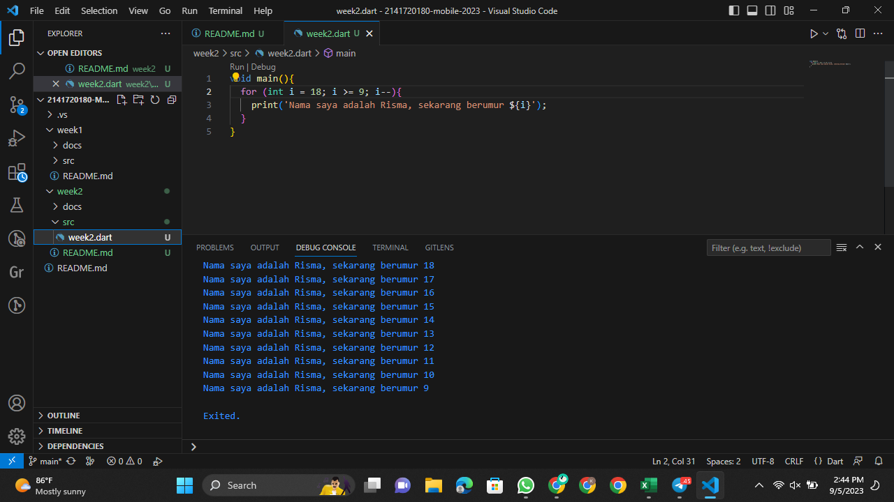

# Pertemuan Minggu 02

### NIM : 2141720180

### NAMA : Magfiroh Indah Karisma

## Soal 1

## Soal 2
Sebab Dart adalah bahasa yang digunakan dalam pengembangan framework Flutter. Mempelajari bahasa Dart terlebih dahulu memungkinkan kita untuk lebih memahami kode Flutter dengan baik.

## Soal 3
Dart adalah bahasa inti dalam Flutter. Pengembang perlu memahaminya karena Dart adalah dasar untuk bekerja dengan Flutter, memungkinkan pembuatan aplikasi seluler yang luar biasa, dan meningkatkan produktivitas pengembangan.

Dart menggabungkan fitur-fitur dari bahasa tingkat tinggi, termasuk productive tooling, garbage collection, type annotations, statically typed dan portability. Ini penting dalam pengembangan Flutter karena Dart digunakan di semua aspek framework.

Ada dua mode eksekusi Dart: Kompilasi JIT (Just-In-Time), di mana kode sumber Dart dikompilasi saat diperlukan untuk fitur seperti debugging dan hot reload, cocok untuk pengembangan aplikasi mobile; dan Kompilasi AOT (Ahead-Of-Time), di mana kode Dart dan Dart VM dikompilasi sebelumnya, memberikan kinerja yang lebih tinggi tetapi tanpa fitur debugging dan hot reload, lebih efisien untuk aplikasi produksi. Kedua mode ini memungkinkan kode Dart berjalan di berbagai lingkungan sesuai kebutuhan.

Dart adalah bahasa berorientasi objek yang mendukung fitur-fitur seperti encapsulation, inheritance, composition, abstraction, dan polymorphism. Operator dalam Dart sebenarnya adalah metode yang didefinisikan dalam class, misalnya, x == y sebenarnya adalah pemanggilan metode x.==(y) untuk perbandingan kesetaraan. Dart memiliki operator aritmatika seperti +, -, *, /, ~/, dan %, serta operator increment dan decrement (++var, var--). Operator persamaan dan relasional (==, !=, >, <, >=, <=) membandingkan isi variabel, bukan referensi. Dart juga memiliki operator logika (!, ||, &&) untuk operasi logika pada ekspresi bool.