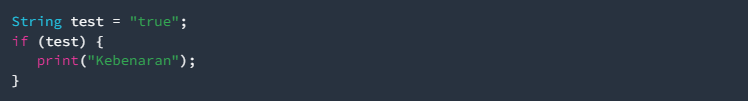
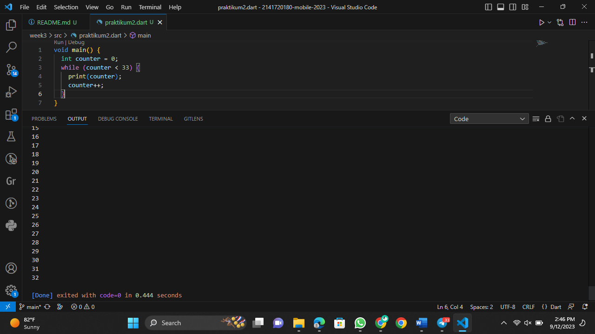

# Pertemuan Minggu 02

### NIM : 2141720180

### NAMA : Magfiroh Indah Karisma

## Soal 1
### Praktikum 1: Menerapkan contoh flows ("if/else")
#### Langkah 1:
Ketik atau salin kode program berikut ke dalam fungsi main().

#### Langkah 2:
Silakan coba eksekusi (Run) kode pada langkah 1 tersebut. Apa yang terjadi? Jelaskan!

#### Langkah 3:
Tambahkan kode program berikut, lalu coba eksekusi (Run) kode Anda.

Apa yang terjadi? Jika terjadi error, silakan perbaiki namun tetap menggunakan if/else.

Berikut setelah dilakukan perbaikan:

Pada kode program pertama, perintah else dan else if tidak diketik sepenuhnya menggunakan huruf kecil sehingga menimbulkan error. Kemudian untuk kode program kedua terjadi error karena variabel 'test' sudah ada sebelumnya, pada pengondisian if juga tidak dijabarkan kondisi yang harus dipenuhi, sehingga untuk perbaikannya maka nama variabel harus diubah, serta memberikan kondisi yang tepat.

### Praktikum 2: Menerapkan perulangan "while" dan "do-while"
#### Langkah 1:
Ketik atau salin kode program berikut ke dalam fungsi main().

#### Langkah 2:
Silakan coba eksekusi (Run) kode pada langkah 1 tersebut. Apa yang terjadi? Jelaskan! Lalu perbaiki jika terjadi error.

Terjadi error sebab variabel counter belum diinisiasi.

Berikut setelah dilakukan perbaikan:

Kode menampilkan angka 0 (dari nilai awal variabel) sampai 32 sebab kondisi yang ditunjukkan pada perintah while adalah 'counter < 33'

#### Langkah 3:
Tambahkan kode program berikut, lalu coba eksekusi (Run) kode Anda.

Apa yang terjadi ? Jika terjadi error, silakan perbaiki namun tetap menggunakan do-while.

Tidak terjadi error, hasil menunjukkan bahwa looping dilanjutkan hingga counter < 77.

### Praktikum 3: Menerapkan perulangan "for" dan "break-continue"
#### Langkah 1:
Ketik atau salin kode program berikut ke dalam fungsi main().

#### Langkah 2:
Silakan coba eksekusi (Run) kode pada langkah 1 tersebut. Apa yang terjadi? Jelaskan! Lalu perbaiki jika terjadi error.

Terjadi error sebab tipe data variabel tidak ditentukan serta penulisan variabel yang salah.

Berikut setelah dilakukan perbaikan:

Menampilkan hasil angka nilai awal variabel index, yaitu 10 hingga 26 sebab kondisi menunjukkan < 27.

#### Langkah 3:
Tambahkan kode program berikut di dalam for-loop, lalu coba eksekusi (Run) kode Anda.

Apa yang terjadi ? Jika terjadi error, silakan perbaiki namun tetap menggunakan for dan break-continue.

Terjadi error sebab penulisan 'if' dan 'else if' tidak sepenuhnya menggunakan huruf kecil, tidak menggunakan tanda kurung kurawal { } untuk pengelompokan blok kode, penulisan variabel yang salah serta pengondisian yang salah pada 'else if'.

Berikut setelah dilakukan perbaikan:

## Soal 2
Buatlah sebuah program yang dapat menampilkan bilangan prima dari angka 0 sampai 201 menggunakan Dart. Ketika bilangan prima ditemukan, maka tampilkan nama lengkap dan NIM Anda.

'for' digunakan untuk melakukan perulangan melalui semua angka dari 2 hingga 201. Pada setiap perulangan, dilakukan pemanggilan fungsi 'bilPrima' untuk memeriksa apakah angka tersebut adalah bilangan prima atau bukan. Fungsi 'bilPrima' disini diprogram untuk mengabaikan angka genap selain 2 dan berhenti melakukan perulangan saat mencapai akar kuadrat dari angka yang diperiksa. Jika angka tersebut adalah bilangan prima, maka angka tersebut akan dicetak.

Berikut adalah hasilnya:
(Hasil bilangan prima)

(Hasil bilangan prima dengan nama dan NIM)

## Soal Tambahan
Mencoba perulangan Switch-Case

Pada kasus ini, case yang terpenuhi adalah case 1 dan 2 sebab tidak adanya 'break' antara case 1 dan case 2, sehingga perintah yang dilakukan adalah perintah dalam case 2.