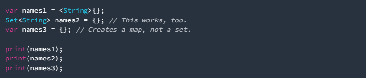
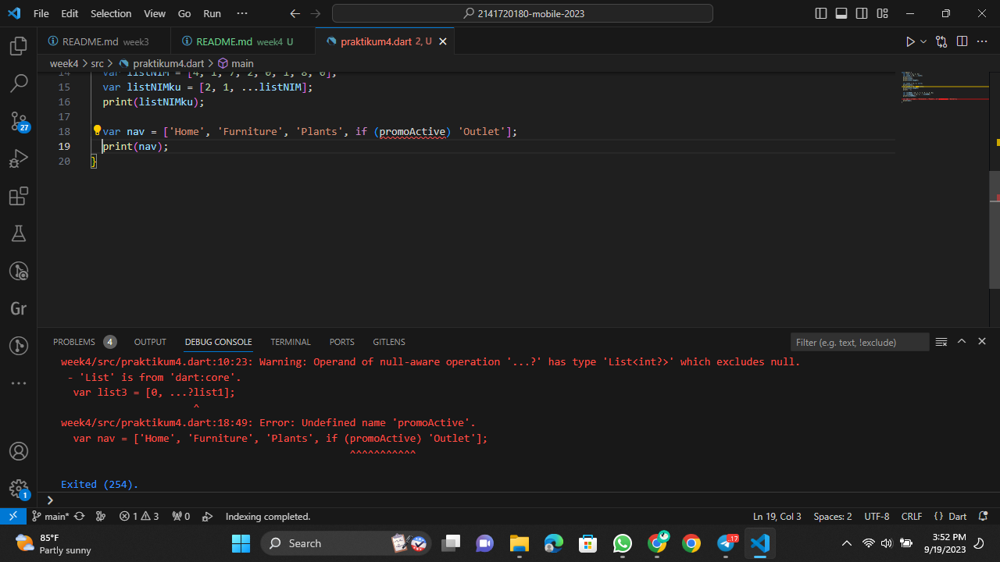
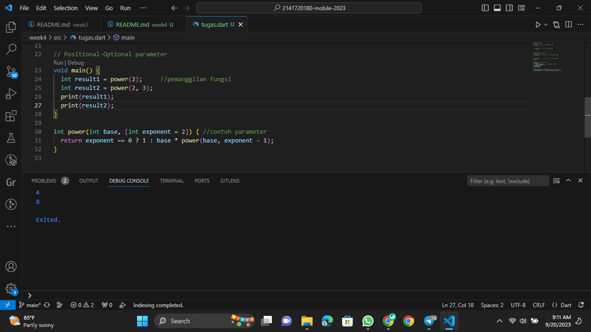

# JOBSHEET 4 - DART : Collection, Records, dan Functions.

### NIM : 2141720180

### NAMA : Magfiroh Indah Karisma

## Soal 1
Silakan selesaikan Praktikum 1 sampai 5, lalu dokumentasikan berupa screenshot hasil pekerjaan Anda beserta penjelasannya!

### PRAKTIKUM 1 : Eksperimen Tipe Data List
#### Langkah 1:
Ketik atau salin kode program berikut ke dalam void main().

#### Langkah 2:
Silakan coba eksekusi (Run) kode pada langkah 1 tersebut. Apa yang terjadi? Jelaskan!

Kode diatas membuat sebuah list dengan tiga elemen (1, 2, dan 3), memeriksa panjangnya (jumlah elemen), mencetak panjang dan elemen kedua dari list, mengubah elemen kedua menjadi 1, memeriksa kembali elemen kedua, dan mencetak nilai elemen kedua setelah perubahan. Pernyataan 'assert' digunakan untuk memeriksa apakah kondisi tertentu terpenuhi dalam kode.

#### Langkah 3:
Ubah kode pada langkah 1 menjadi variabel final yang mempunyai index = 5 dengan default value = null. Isilah nama dan NIM Anda pada elemen index ke-1 dan ke-2. Lalu print dan capture hasilnya.

Apa yang terjadi ? Jika terjadi error, silakan perbaiki.

Berikut setelah diperbaiki:

Mengganti tipe data list menjadi dynamic untuk memungkinkan berbagai jenis data termasuk string dan null.

### PRAKTIKUM 2 : Eksperimen Tipe Data Set
#### Langkah 1:
Ketik atau salin kode program berikut ke dalam fungsi main().

#### Langkah 2:
Silakan coba eksekusi (Run) kode pada langkah 1 tersebut. Apa yang terjadi? Jelaskan! Lalu perbaiki jika terjadi error.

Tidak terjadi error.

#### Langkah 3:
Tambahkan kode program berikut, lalu coba eksekusi (Run) kode Anda.

Apa yang terjadi ? Jika terjadi error, silakan perbaiki namun tetap menggunakan ketiga variabel tersebut. 

Tidak terjadi error.

Tambahkan elemen nama dan NIM Anda pada kedua variabel Set tersebut dengan dua fungsi berbeda yaitu .add() dan .addAll(). Untuk variabel Map dihapus, nanti kita coba di praktikum selanjutnya.

### PRAKTIKUM 3 : Eksperimen Tipe Data Maps
#### Langkah 1:
Ketik atau salin kode program berikut ke dalam fungsi main().

#### Langkah 2:
Silakan coba eksekusi (Run) kode pada langkah 1 tersebut. Apa yang terjadi? Jelaskan! Lalu perbaiki jika terjadi error.

Tidak terjadi error.

#### Langkah 3:
Tambahkan kode program berikut, lalu coba eksekusi (Run) kode Anda.

Apa yang terjadi ? Jika terjadi error, silakan perbaiki.

Tambahkan elemen nama dan NIM Anda pada tiap variabel di atas (gifts, nobleGases, mhs1, dan mhs2). Dokumentasikan hasilnya dan buat laporannya!

### PRAKTIKUM 4 : Eksperimen Tipe Data List: Spread dan Control-flow Operators
#### Langkah 1:
Ketik atau salin kode program berikut ke dalam fungsi main().

#### Langkah 2:
Silakan coba eksekusi (Run) kode pada langkah 1 tersebut. Apa yang terjadi? Jelaskan! Lalu perbaiki jika terjadi error.

#### Langkah 3:
Tambahkan kode program berikut, lalu coba eksekusi (Run) kode Anda.

Apa yang terjadi ? Jika terjadi error, silakan perbaiki.

Penggunaan '...?' memungkinkan elemen 'null' turut diinputkan ke list baru sehingga length dari list3 menjadi 4, namun jika hanya menggunakan '...' tanpa tanda tanya maka elemen null tidak akan diinputkan ke list baru.

Tambahkan variabel list berisi NIM Anda menggunakan Spread Operators. Dokumentasikan hasilnya dan buat laporannya!

#### Langkah 4:
Tambahkan kode program berikut, lalu coba eksekusi (Run) kode Anda.

Apa yang terjadi ? Jika terjadi error, silakan perbaiki. Tunjukkan hasilnya jika variabel promoActive ketika true dan false.

Terjadi error sebab variabel 'promoActive' belum didefinisikan.

Berikut setelah diperbaiki:
Jika variabel 'promoActive' bernilai true maka 'Outlet' akan ditampilkan.

Jika variabel 'promoActive' bernilai false maka 'Outlet' tidak akan ditampilkan.

#### Langkah 5:
Tambahkan kode program berikut, lalu coba eksekusi (Run) kode Anda.

Apa yang terjadi ? Jika terjadi error, silakan perbaiki.

Sama seperti sebelumnya, kode error sebab variabel belum didefinisikan.

Berikut setelah diperbaiki:

Tunjukkan hasilnya jika variabel login mempunyai kondisi lain.

Jika variabel login memiliki kondisi lain maka 'Inventory' tidak akan ditampilkan.

#### Langkah 6:
Tambahkan kode program berikut, lalu coba eksekusi (Run) kode Anda.

Apa yang terjadi ? Jika terjadi error, silakan perbaiki. 

Tidak terjadi error.

Jelaskan manfaat Collection For dan dokumentasikan hasilnya.

Collection For adalah fitur dalam bahasa pemrograman Dart yang memungkinkan untuk membuat dan menginisialisasi koleksi (seperti list, map, atau set) dengan cara yang lebih singkat.

### PRAKTIKUM 5 : Eksperimen Tipe Data Records
#### Langkah 1:
Ketik atau salin kode program berikut ke dalam fungsi main().

#### Langkah 2:
Silakan coba eksekusi (Run) kode pada langkah 1 tersebut. Apa yang terjadi? Jelaskan! Lalu perbaiki jika terjadi error.

Tidak terjadi error.

#### Langkah 3:
Tambahkan kode program berikut di luar scope void main(), lalu coba eksekusi (Run) kode Anda.

Apa yang terjadi ? Jika terjadi error, silakan perbaiki. 

Tidak terjadi error.

Gunakan fungsi tukar() di dalam main() sehingga tampak jelas proses pertukaran value field di dalam Records.

#### Langkah 4:
Tambahkan kode program berikut di dalam scope void main(), lalu coba eksekusi (Run) kode Anda.

Apa yang terjadi ? Jika terjadi error, silakan perbaiki. 

Terjadi error sebab variabel non-nullable belum diinisialisasi.

Inisialisasi field nama dan NIM Anda pada variabel record mahasiswa di atas. Dokumentasikan hasilnya dan buat laporannya!

#### Langkah 5:
Tambahkan kode program berikut di dalam scope void main(), lalu coba eksekusi (Run) kode Anda.

Apa yang terjadi? Jika terjadi error, silakan perbaiki. 

Tidak terjadi error.

Gantilah salah satu isi record dengan nama dan NIM Anda, lalu dokumentasikan hasilnya dan buat laporannya!

## Soal 2
Jelaskan yang dimaksud Functions dalam bahasa Dart!

Fungsi (functions) adalah blok kode yang dapat digunakan untuk melakukan tugas-tugas tertentu. Fungsi dapat menerima nol atau lebih parameter sebagai masukan, melakukan operasi tertentu, dan mengembalikan nilai (atau void jika tidak mengembalikan nilai).

## Soal 3
Jelaskan jenis-jenis parameter di Functions beserta contoh sintaksnya!
- Required Parameters (Parameter Wajib):
Parameter ini harus diberikan saat memanggil fungsi, dan tidak memiliki nilai default. Dalam deklarasi fungsi, mereka didefinisikan tanpa tanda kurung kurawal {}.
Contoh sintaks:

- Optional Parameters (Parameter Opsional):

Ada dua jenis parameter opsional dalam Dart:

a. Named Parameters (Parameter dengan Nama): Parameter ini diberikan dengan menyebutkan namanya saat pemanggilan fungsi. Didefinisikan dengan menggunakan tanda kurung kurawal {} dan diberi nilai default.
Contoh sintaks:

b. Positional Parameters (Parameter Posisi): Parameter ini diberikan berdasarkan posisi mereka dalam deklarasi fungsi. Didefinisikan dengan menggunakan tanda kurung siku [] dan dapat memiliki nilai default.
Contoh sintaks:

- Rest Parameters (Parameter Sisa):

Parameter sisa digunakan ketika Anda ingin menerima sejumlah argumen yang tidak terbatas dalam bentuk daftar atau array. Ini digunakan dengan prefix tiga titik (...).
Contoh sintaks:

## Soal 4
Jelaskan maksud Functions sebagai first-class objects beserta contoh sintaknya!
Konsep "functions as first-class objects" (fungsi sebagai objek tingkat pertama) bermaksud fungsi diperlakukan seperti objek lainnya seperti string, integer, atau array. Ini berarti dapat menyimpan fungsi dalam variabel, mengirimkannya sebagai argumen ke fungsi lain, dan mengembalikannya sebagai nilai dari fungsi lain. 

## Soal 5
Apa itu Anonymous Functions? Jelaskan dan berikan contohnya!

Anonymous functions (fungsi anonim), juga dikenal sebagai lambda functions atau closures digunakan untuk membuat fungsi sederhana yang dapat digunakan sebagai argumen dalam pemanggilan fungsi lain, atau untuk eksekusi satu kali tanpa perlu mendefinisikan nama fungsi.

## Soal 6
Jelaskan perbedaan Lexical scope dan Lexical closures! Berikan contohnya!
- Lexical Scope (Lingkup Leksikal): Menentukan di mana variabel dapat diakses dalam kode berdasarkan struktur kode.

- Lexical Closures (Closure Leksikal): Mengacu pada kemampuan fungsi untuk "mengingat" lingkungan di mana mereka dibuat, sehingga dapat mengakses variabel-variabel dalam lingkungan tersebut bahkan setelah lingkungan tersebut seharusnya sudah tidak ada. Closures memanfaatkan konsep lexical scope.

## Soal 7
Jelaskan dengan contoh cara membuat return multiple value di Functions!

'getNumbers()' mengembalikan List berisi beberapa angka, dan fungsi 'main()' kemudian mencetak angka-angka tersebut.

## Soal 8
Kumpulkan berupa link commit repo GitHub pada tautan yang telah disediakan di grup Telegram!