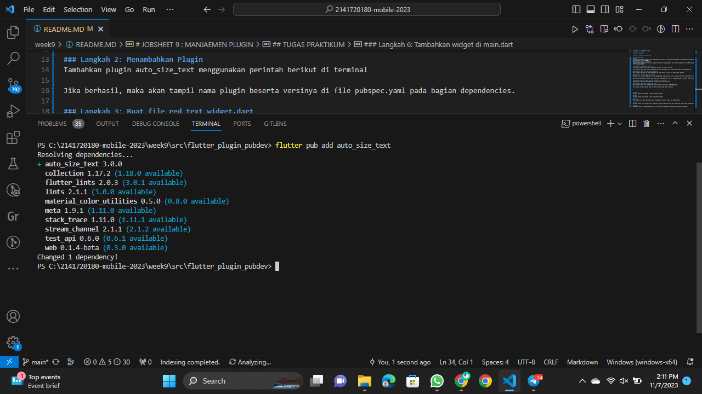
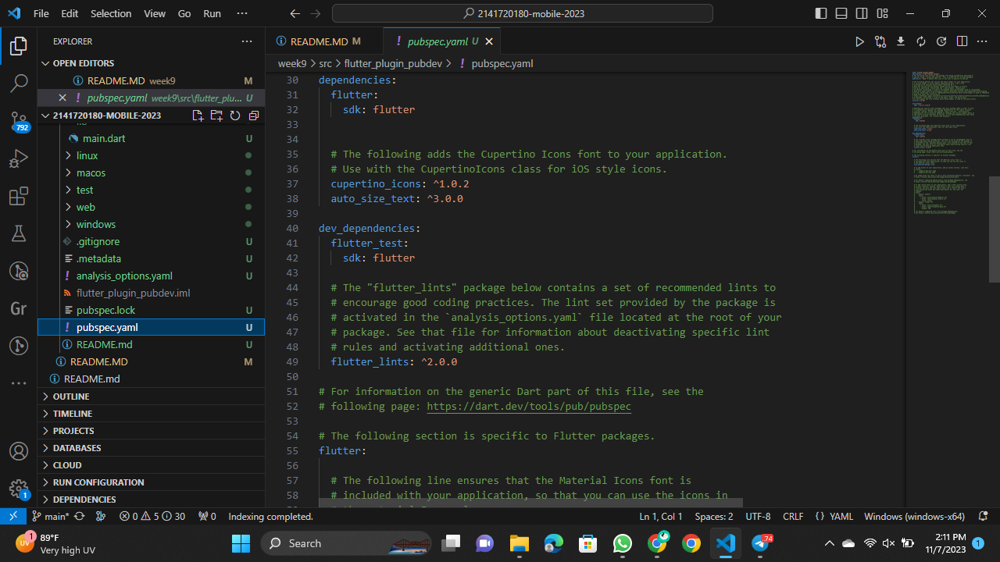
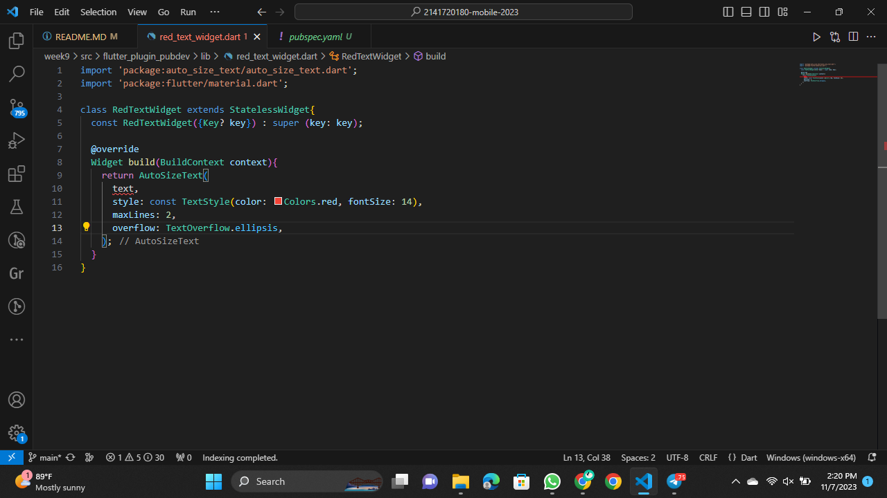
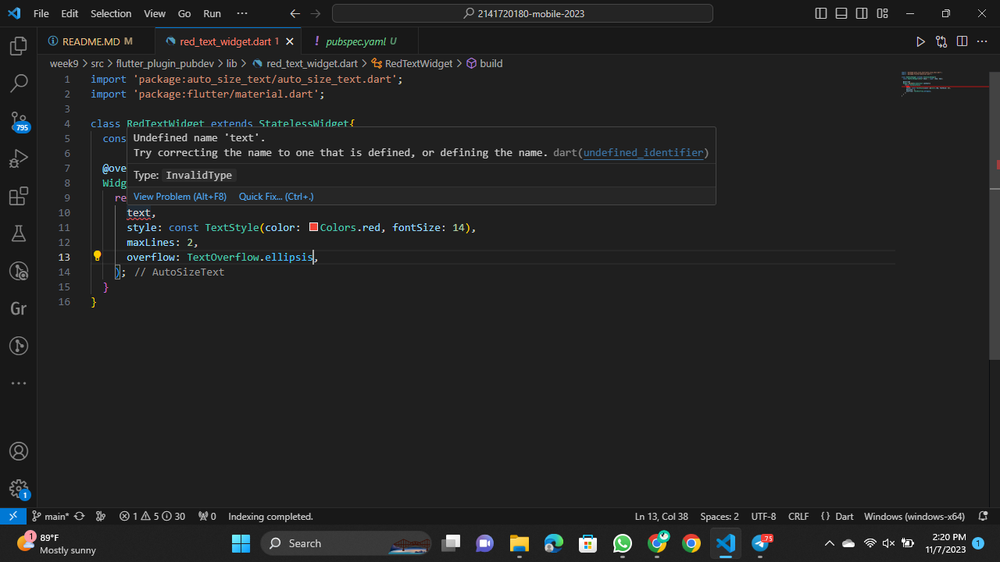
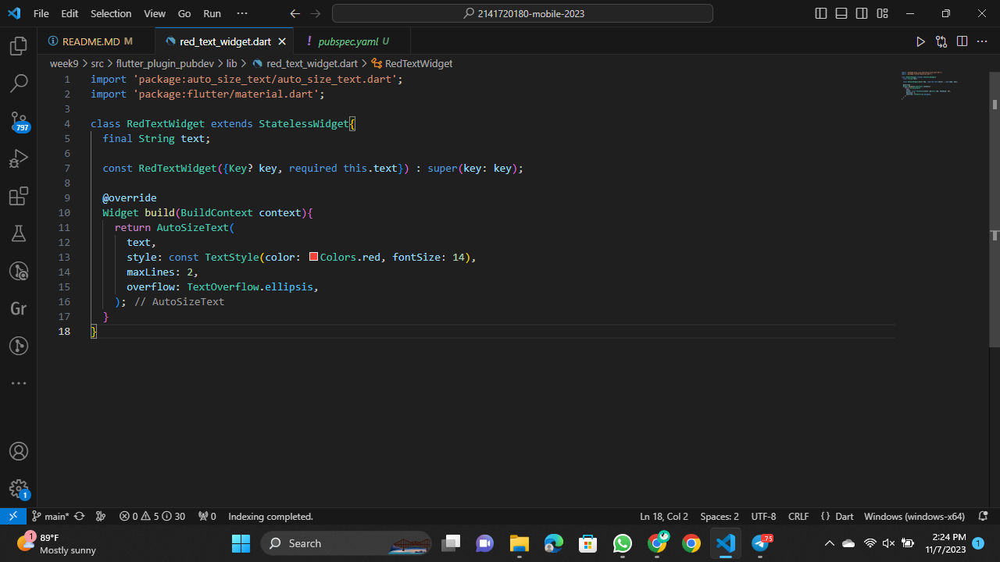
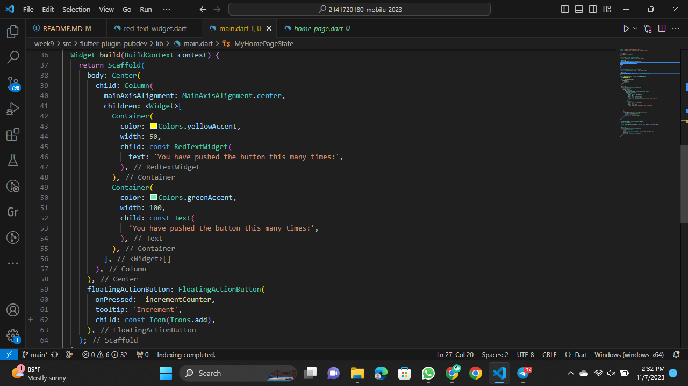
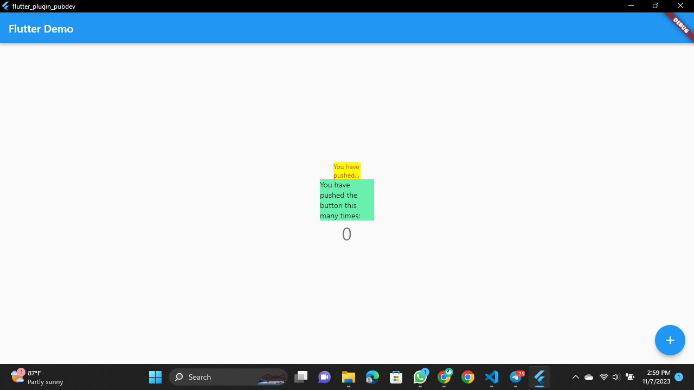

# JOBSHEET 9 : MANJAEMEN PLUGIN

### NIM : 2141720180

### NAMA : Magfiroh Indah Karisma

## TUGAS PRAKTIKUM
### Soal 1
Selesaikan Praktikum tersebut, lalu dokumentasikan dan push ke repository Anda berupa screenshot hasil pekerjaan beserta penjelasannya di file README.md!
### Langkah 1: Buat Project Baru
Buatlah sebuah project flutter baru dengan nama flutter_plugin_pubdev. Lalu jadikan repository di GitHub Anda dengan nama flutter_plugin_pubdev.

### Langkah 2: Menambahkan Plugin
Tambahkan plugin auto_size_text menggunakan perintah berikut di terminal

Jika berhasil, maka akan tampil nama plugin beserta versinya di file pubspec.yaml pada bagian dependencies.

### Langkah 3: Buat file red_text_widget.dart
Buat file baru bernama red_text_widget.dart di dalam folder lib lalu isi kode seperti berikut.
.png)

### Langkah 4: Tambah Widget AutoSizeText
Masih di file red_text_widget.dart, untuk menggunakan plugin auto_size_text, ubahlah kode return Container() menjadi seperti berikut.

Setelah Anda menambahkan kode di atas, Anda akan mendapatkan info error. Mengapa demikian? Jelaskan dalam laporan praktikum Anda!

### Langkah 5: Buat Variabel text dan parameter di constructor
Tambahkan variabel text dan parameter di constructor seperti berikut.

### Langkah 6: Tambahkan widget di main.dart
Buka file main.dart lalu tambahkan di dalam children: pada class _MyHomePageState

Run aplikasi tersebut dengan tekan F5, maka hasilnya akan seperti berikut.

### Soal 2
Jelaskan maksud dari langkah 2 pada praktikum tersebut!
##### Langkah 2 adalah instruksi untuk menambahkan plugin auto_size_text ke proyek Flutter menggunakan perintah flutter pub add auto_size_text di terminal. Setelah menjalankan perintah tersebut, plugin auto_size_text akan ditambahkan ke proyek dan informasi tentang plugin tersebut akan ditambahkan ke file pubspec.yaml pada bagian dependencies. 

### Soal 3
Jelaskan maksud dari langkah 5 pada praktikum tersebut!
##### Langkah 5 adalah instruksi untuk menambahkan variabel text ke dalam widget RedTextWidget dan memasukkannya sebagai parameter di dalam constructor. Variabel text ini akan digunakan untuk menentukan teks yang akan ditampilkan oleh widget RedTextWidget. Dengan menambahkan final String text;, dapat mendeklarasikan variabel text yang akan menerima teks yang akan ditampilkan.

### Soal 4
Pada langkah 6 terdapat dua widget yang ditambahkan, jelaskan fungsi dan perbedaannya!
1. RedTextWidget:

- Widget yang dibuat sendiri (telah dijelaskan dalam langkah sebelumnya).
- Menerima parameter text yang memungkinkan untuk menentukan teks yang akan ditampilkan oleh widget.
- Mengatur teks dengan gaya teks warna merah dan ukuran font 14.
- Mempunyai kemampuan untuk mengatur jumlah maksimum baris yang ditampilkan dan mengatasi overflow teks dengan ellipsis (tanda titik-titik) jika teks terlalu panjang.
- Digunakan untuk menampilkan teks dengan gaya khusus yang ditetapkan dalam widget yang dapat diatur ulang sesuai kebutuhan.
2. Text:

- Widget bawaan Flutter yang digunakan untuk menampilkan teks statis.
- Tidak menerima parameter text seperti RedTextWidget. Sebaliknya, hanya memberikan teks yang akan ditampilkan sebagai argumen di dalam Text widget itu sendiri.
- Mengatur teks dengan gaya teks default, tidak ada pengaturan warna atau ukuran font yang disetel secara khusus.
- Tidak memiliki pengaturan otomatis jumlah maksimum baris atau ellipsis untuk mengatasi overflow teks. Teks akan tetap tampil sesuai dengan panjangnya.

##### Dengan kata lain, RedTextWidget adalah widget yang dibuat sendiri dengan kemampuan untuk menampilkan teks dengan gaya khusus dan fitur tambahan, sedangkan Text adalah widget bawaan Flutter yang sederhana dan tidak memiliki gaya atau fitur khusus, dan hanya digunakan untuk menampilkan teks statis.

### Soal 5
Jelaskan maksud dari tiap parameter yang ada di dalam plugin auto_size_text berdasarkan tautan pada dokumentasi ini !
1. text (String): 
Parameter ini digunakan untuk menentukan teks yang akan ditampilkan oleh widget AutoSizeText.
2. style (TextStyle):
Digunakan untuk menentukan gaya teks yang akan diterapkan pada teks yang ditampilkan. Ini mencakup properti seperti warna teks, ukuran font, dan atribut gaya teks lainnya.
3. maxLines (int):
Parameter ini memungkinkan Anda untuk mengatur jumlah maksimum baris yang akan digunakan oleh teks. Jika teks melebihi jumlah baris ini, maka teks akan dipotong dan ditampilkan dengan ellipsis (tanda titik-titik).
4. overflow (TextOverflow):
Digunakan untuk mengatur bagaimana teks akan ditampilkan jika melebihi jumlah maksimum baris yang ditentukan. Nilai yang mungkin antara lain TextOverflow.ellipsis untuk menambahkan ellipsis, TextOverflow.clip untuk memotong teks, dan lainnya.
5. softWrap (bool):
Parameter ini mengontrol apakah teks akan di-wrapping (pindah ke baris berikutnya) jika melebihi lebar yang tersedia. Jika diatur ke true, teks akan wrapping; jika diatur ke false, teks akan memotong.
6. textAlignment (TextAlign):
Digunakan untuk mengatur perataan teks, seperti TextAlign.left, TextAlign.center, atau TextAlign.right.
7. stepGranularity (double):
Mengontrol granularitas ukuran font ketika melakukan autosizing. Nilai lebih tinggi akan membuat perubahan ukuran font lebih kasar, sementara nilai yang lebih rendah akan memberikan penyesuaian ukuran yang lebih halus.
8. maxFontSize (double):
Parameter ini memungkinkan Anda untuk menentukan ukuran font maksimum yang dapat digunakan oleh teks.
9. minFontSize (double):
Parameter ini digunakan untuk menentukan ukuran font minimum yang akan diterapkan pada teks jika ada keterbatasan ruang.
10. presetFontSizes (List< double >):
Berisi daftar ukuran font yang akan digunakan untuk mengukur ukuran font otomatis teks. AutoSizeText akan memilih ukuran font terbaik dari daftar ini berdasarkan ruang yang tersedia.

### Soal 6
Kumpulkan laporan praktikum Anda berupa link repository GitHub ke spreadsheet yang telah disediakan!